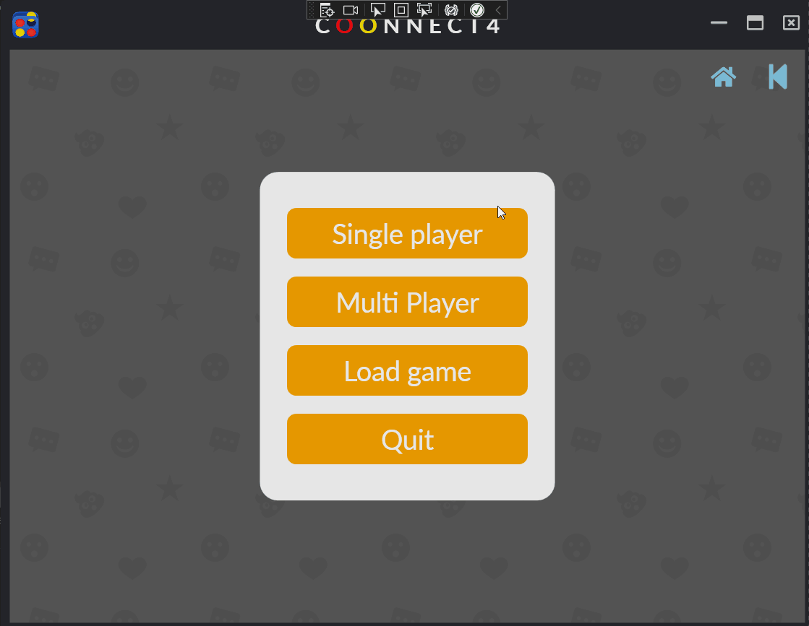

# Connect4WPF

## Introduction
This project is a Connect 4 game developed using C# and WPF, incorporating the Caliburn.Micro library. The game uses object-oriented principles along with the MVVM architecture model and includes AI functionality for setting the computer player's difficulty using the Minimax algorithm.


## Table of Contents
- [Introduction](#introduction)
- [Features](#features)
- [Installation](#installation)
- [Usage](#usage)
- [Dependencies](#dependencies)
- [Detailed Code Analysis](#detailed-code-analysis)
  - [Overview](#overview)
  - [Code Structure](#code-structure)
  - [Key Components](#key-components)
  - [AI Implementation](#ai-implementation)
  - [Design Patterns](#design-patterns)
- [Contributors](#contributors)

## Features
- **Interactive Gameplay**: Play Connect 4 against a computer or another player.
- **AI Difficulty**: Computer player difficulty set using the Minimax algorithm.
- **MVVM Architecture**: Uses Model-View-ViewModel pattern for clear separation of concerns.
- **Responsive UI**: Built with WPF for a modern and responsive user interface.

## Installation

1. Clone the repository:
   ```bash
   git clone https://github.com/Adnan25z/Connect4WPF.git
2. Open the project in Visual Studio.
3. Build the solution and run the application.

## Usage
1. Launch the application.
2. Choose to play against the computer or another player.
3. Use the UI to place your pieces and try to connect four in a row.

## Dependencies
- C#
- .NET Framework
- WPF
- Caliburn.Micro

## Detailed Code Analysis
### Overview
This project implements a Connect 4 game using the WPF framework and C#. It follows the MVVM architecture pattern and uses the Caliburn.Micro library for better separation of concerns and manageability.

### Code Structure
1. Models: Contains the game logic and data structures.
2. ViewModels: Manages the presentation logic and data binding to views.
3. Views: XAML files defining the user interface.
4. Utils: Utility classes and helpers for common tasks.
   
### Key Components
- Game Board: The main game board logic and rendering.
- Player Logic: Handles player moves and game state.
- AI Logic: Implements the Minimax algorithm for AI decisions.
- UI Binding: Uses data binding to connect the ViewModels to the Views.

### AI Implementation
The computer player uses the Minimax algorithm to decide the best move. This algorithm evaluates possible moves by simulating future game states and choosing the move that maximizes the computer player's chances of winning.

### Design Patterns
The project employs the Model-View-ViewModel (MVVM) pattern to separate the UI from business logic, making the code more modular and testable. The Caliburn.Micro library helps manage this architecture by simplifying data binding and event handling.

Contributors
Adnan Zafar


